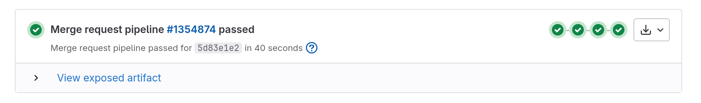
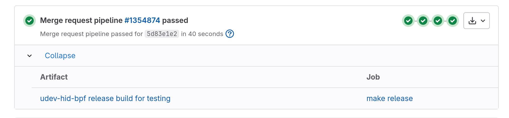
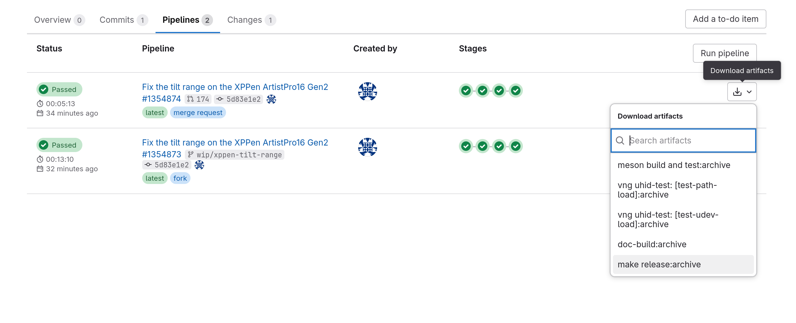

.. _installing_from_ci:

Installing BPFs from our CI
===========================

"CI" refers to `Continuous Integration <https://en.wikipedia.org/wiki/Continuous_integration>`_,
a setup that builds and tests our code on every change. Each such build and test
sequence is referred to as a "pipeline" and you can see all our past piplines
`here <https://gitlab.freedesktop.org/libevdev/udev-hid-bpf/-/pipelines>`_.
A pipeline consists of several "jobs" and jobs may produce downloadable
packages that are referred to as "artifacts". Our CI configuration is in our
repository's
`.gitlab-ci.yml <https://gitlab.freedesktop.org/libevdev/udev-hid-bpf/-/blob/main/.gitlab-ci.yml?ref_type=heads>`_
file.

Our CI produces artifacts for each `merge request <https://gitlab.freedesktop.org/libevdev/udev-hid-bpf/-/merge_requests>`_
that contain a pre-compiled ``udev-hid-bpf`` and BPFs
that can be immediately used and tested without the need to clone
the repository and build ``udev-hid-bpf`` itself.
Using those is the quickest way to test a suggested fix for your device.
If instead you want to build everything locally, please see :ref:`getting_started`.

Downloading and installing pre-compiled packages
------------------------------------------------

Select the corresponding `merge request <https://gitlab.freedesktop.org/libevdev/udev-hid-bpf/-/merge_requests>`_ and
click on the "view exposed artifact link" to expand the corresponding section:

Then click on the link named "udev-hid-bpf release build for testing" and download the tarball:

Open a terminal and navigate to the path you downloaded the tarball too, e.g. ``~/Downloads/`` and
unpack it:

.. code-block:: console

   $ cd ~/Downloads
   $ tar xf udev-hid-bpf.tar.xz
   $ cd udev-hid-bpf-*/

The tarball provides a simple ``install.sh`` script that will install everything for you. This
script provides a ``--dry-run`` option to only print what it's about to do:

.. code-block:: console

   $ ./install.sh --dry-run
   --dry-run given, nothing will be installed and no command is run
   Using sudo to install files into /usr/local. You may be asked for your password now
   sudo install -D -t /usr/local/lib/firmware/hid/bpf /home/user/Downloads/udev-hid-bpf_2.1.0-20240704-106-gc9dbf3273ad8/lib/firmware/hid/bpf/0020-Huion__Kamvas-Pro-19.bpf.o
   sudo install -D -t /usr/local/lib/firmware/hid/bpf /home/user/Downloads/udev-hid-bpf_2.1.0-20240704-106-gc9dbf3273ad8/lib/firmware/hid/bpf/0019-Huion__Kamvas-Pro-19.bpf.o
   sudo install -D -t /usr/local/lib/firmware/hid/bpf /home/user/Downloads/udev-hid-bpf_2.1.0-20240704-106-gc9dbf3273ad8/lib/firmware/hid/bpf/0020-XPPen__ArtistPro16Gen2.bpf.o
   sudo install -D -t /usr/local/lib/firmware/hid/bpf /home/user/Downloads/udev-hid-bpf_2.1.0-20240704-106-gc9dbf3273ad8/lib/firmware/hid/bpf/0019-XPPen__ArtistPro16Gen2.bpf.o
   sudo install -D -t /usr/local/lib/firmware/hid/bpf /home/user/Downloads/udev-hid-bpf_2.1.0-20240704-106-gc9dbf3273ad8/lib/firmware/hid/bpf/0010-Huion__KeydialK20.bpf.o
   sudo install -D -t /usr/local/lib/firmware/hid/bpf /home/user/Downloads/udev-hid-bpf_2.1.0-20240704-106-gc9dbf3273ad8/lib/firmware/hid/bpf/0009-Huion__KeydialK20.bpf.o
   sudo install -D -t /usr/local/lib/firmware/hid/bpf /home/user/Downloads/udev-hid-bpf_2.1.0-20240704-106-gc9dbf3273ad8/lib/firmware/hid/bpf/0010-TUXEDO__Sirius-16-Gen1-and-Gen2.bpf.o
   sudo install -D -t /usr/local/lib/firmware/hid/bpf /home/user/Downloads/udev-hid-bpf_2.1.0-20240704-106-gc9dbf3273ad8/lib/firmware/hid/bpf/0009-TUXEDO__Sirius-16-Gen1-and-Gen2.bpf.o
   sudo install -D -m 644 -t /etc/udev/rules.d /home/user/Downloads/udev-hid-bpf_2.1.0-20240704-106-gc9dbf3273ad8/_inst/etc/udev/rules.d/81-hid-bpf.rules
   sudo install -D -m 644 -t /etc/udev/rules.d /home/user/Downloads/udev-hid-bpf_2.1.0-20240704-106-gc9dbf3273ad8/lib/udev/rules.d/81-hid-bpf.rules
   sudo install -D -m 644 -t /etc/udev/hwdb.d /home/user/Downloads/udev-hid-bpf_2.1.0-20240704-106-gc9dbf3273ad8/_inst/etc/udev/hwdb.d/81-hid-bpf-testing.hwdb
   sudo install -D -t /usr/local/bin/ /home/user/Downloads/udev-hid-bpf_2.1.0-20240704-106-gc9dbf3273ad8/bin/udev-hid-bpf
   sudo udevadm control --reload
   sudo systemd-hwdb update

Or if you want to limit the BPF programs files to install, use a **quoted** glob:

.. code-block:: console

   $ ./install.sh --dry-run "*Huion*"
   --dry-run given, nothing will be installed and no command is run
   Using sudo to install files into /usr/local. You may be asked for your password now
   sudo install -D -t /usr/local/lib/firmware/hid/bpf /home/user/Downloads/udev-hid-bpf_2.1.0-20240704-106-gc9dbf3273ad8/lib/firmware/hid/bpf/0020-Huion__Kamvas-Pro-19.bpf.o
   sudo install -D -t /usr/local/lib/firmware/hid/bpf /home/user/Downloads/udev-hid-bpf_2.1.0-20240704-106-gc9dbf3273ad8/lib/firmware/hid/bpf/0019-Huion__Kamvas-Pro-19.bpf.o
   sudo install -D -t /usr/local/lib/firmware/hid/bpf /home/user/Downloads/udev-hid-bpf_2.1.0-20240704-106-gc9dbf3273ad8/lib/firmware/hid/bpf/0010-Huion__KeydialK20.bpf.o
   sudo install -D -t /usr/local/lib/firmware/hid/bpf /home/user/Downloads/udev-hid-bpf_2.1.0-20240704-106-gc9dbf3273ad8/lib/firmware/hid/bpf/0009-Huion__KeydialK20.bpf.o
   sudo install -D -m 644 -t /etc/udev/rules.d /home/user/Downloads/udev-hid-bpf_2.1.0-20240704-106-gc9dbf3273ad8/_inst/etc/udev/rules.d/81-hid-bpf.rules
   sudo install -D -m 644 -t /etc/udev/rules.d /home/user/Downloads/udev-hid-bpf_2.1.0-20240704-106-gc9dbf3273ad8/lib/udev/rules.d/81-hid-bpf.rules
   sudo install -D -m 644 -t /etc/udev/hwdb.d /home/user/Downloads/udev-hid-bpf_2.1.0-20240704-106-gc9dbf3273ad8/_inst/etc/udev/hwdb.d/81-hid-bpf-testing.hwdb
   sudo install -D -t /usr/local/bin/ /home/user/Downloads/udev-hid-bpf_2.1.0-20240704-106-gc9dbf3273ad8/bin/udev-hid-bpf
   sudo udevadm control --reload
   sudo systemd-hwdb update

.. note:: The glob **must** be quoted so it is passed as-is to the ``install.sh`` script.
          Without quotes the shell will try to expand the glob before passing it on.

And if you're happy with the list of files then run the script:

.. code-block:: console

   $ ./install.sh
   Using sudo to install files into /usr/local. You may be asked for your password now
   $ tree /usr/local/lib/firmware
   /usr/local/lib/firmware
   └── hid
       └── bpf
           ├── 0009-TUXEDO__Sirius-16-Gen1-and-Gen2.bpf.o
           ├── 0010-Huion__KeydialK20.bpf.o
           ├── 0010-TUXEDO__Sirius-16-Gen1-and-Gen2.bpf.o
           ├── 0019-Huion__Kamvas-Pro-19.bpf.o
           ├── 0019-XPPen__ArtistPro16Gen2.bpf.o
           ├── 0020-Huion__Kamvas-Pro-19.bpf.o
           └── 0020-XPPen__ArtistPro16Gen2.bpf.o

Or with the quoted glob:

.. code-block:: console

   $ ./install.sh "*Huion*"
   Using sudo to install files into /usr/local. You may be asked for your password now
   $ tree /usr/local/lib/firmware
   /usr/local/lib/firmware
   └── hid
       └── bpf
           ├── 0010-Huion__KeydialK20.bpf.o
           ├── 0019-Huion__Kamvas-Pro-19.bpf.o
           ├── 0020-Huion__KeydialK20.bpf.o
           └── 0020-Huion__Kamvas-Pro-19.bpf.o

Once installed, replug the device and the new BPF should be loaded automatically. If the BPF loads
correctly it will show up in ``/sys``:

.. code-block:: console

    $ sudo tree /sys/fs/bpf/hid/
    /sys/fs/bpf/hid
    ├── 0003_256C_006B_0017
    │   └── 0010-Huion__Kamvas_Pro_19_bpf
    │       └── huion_Kamvas_pro_19
    ├── 0003_256C_006B_0018
    │   └── 0010-Huion__Kamvas_Pro_19_bpf
    │       └── huion_Kamvas_pro_19
    └── 0003_256C_006B_0019
        └── 0010-Huion__Kamvas_Pro_19_bpf
            └── huion_Kamvas_pro_19

The above output shows that we have a USB (``0003``) device with the vendor/product ID ``256C`` and
``006B`` that exports three HID devices sequentially numbered ``17``, ``18``,
``19`` (those numbers increase on every unplug). Each of those HID devices as one BPF object loaded
(``0010-Huion__Kamvas_Pro_19_bpf``) and those objects install one function
pointer table each (grep for ``HID_BPF_OPS`` in our BPF source files if you're
interested).

The ``install.sh`` script will also install ``udev-hid-bpf`` itself (required as it is invoked by the installed udev rule).
The default prefix is ``/usr/local`` and all files will be installed under that
prefix. The exception are udev rules which will be installed in ``/etc``.

Keep the directory around until testing is complete, you can uninstall it all with:

.. code-block:: console

   $ ./uninstall.sh --dry-run
   ...
   $ ./uninstall.sh
   ...
   $ ./uninstall.sh "*Huion*"

As above, using ``--dry-run`` first will list all files that are to be removed
and the glob will limit the files that are uninstalled.

Finding previous artifacts
--------------------------

If the merge request pipeline is re-triggered after a code update the newly generated artifact
will be available by following the same links. To re-retreive a tarball from an earlier pipeline
please click on the ``Pipelines`` tab and select the ``make release:archive`` entry from the
corresponding pipeline's downloads:

This will download an ``artifacts.zip`` that contains the ``udev-hid-bpf.tar.xz`` tarball as above.
